<h1 align="center">Harry Potter Pairs Game</h1>

<h2 align="center">Code Institute - Milestone Project 2</h2>

Hello, this a Harry Potter pairs game and is the second of four Milestone Projects that make up the Full Stack Web Development Program at the Code Institue. 

The project is developed using **HTML**, **CSS** and **JavaScript** with a litle use of bootstrap.

[View website on GitHub Pages](https://gersondelacruzdeveloper.github.io/Milestone-Project2/)

## Table of contents
1. [**User   (UX)**](#User-experience)
     1. [Strategy](#strategy)
     2. [Scope](#scope)
     3. [Structure](#structure)
     4. [Skeleton](#skeleton)
     5. [Surface](#surface)
2. [Features](#features)
     1. [Existing Features](#existing-features)
     2. [Future Feature Considerations](#future-feature-considerations)
3. [**Technologies Used**](#technologies-used)
4. [**Testing**](#testing)
    1. [Performance](#performance)
    2. [HTML Validation](#html-validation)
    3. [CSS Validation](#css-validation)
    4. [Manual Testing](#manual-testing)
    5. [Responsiveness](#responsiveness)
    6. [Tested User Stories](#tested-user-stories)
    7. [Bugs](#bugs)
5. [**Deployment**](#deployment)
    1. [How this Project was Deployed](#how-this-project-was-deployed)
    2.  [How to Run this Project in your Browser](#how-to-run-this-project-in-your-browser)
    3. [Cloning the Repository](#Cloning-the-Repository)
    4. [Manually Downloading the Repository](#Manually-Downloading-the-Repository)
    5. [ Opening the Repository](#Opening-the-Repository)
6. [**Credits**](#credits)
    1. [Content](#content)
    2. [Media](#media)
    3. [Code](#code)
7. [Acknowledgements](#acknowledgements)
8. [Disclaimer](#disclaimer)

      
---
##  User Experience

### Strategy

- The User centred Design process started with the creation of the User Stories. these influenced subsequent feature, layout, and design decisions.

- The goal of this project was to create an interactive and user-friendly version of the matching cards game.

#### User Stories

#### Potential site user
As a potential site user: : 
- I want to play a game that has simple rules. 
- I want to play a game that is fun and engaging.
- I want to play a game that show instruction of how to play.
- I want to play a game that the colors are atractive to the eyes but not too bright to cause me discomfort.
- I want to play a game that has link to popular culture. 
- I want to be able to mute the sounds in case I am in a public place.
- I want to be able to contact the game owner with any questions.
- I want to be able to see my game score.
- I want to be challenge and restricted to a countdown clock.

#### Game owner
As a game owner:
- I want to create a game which is entertaining and engaging.
- I want to create visually appealing design.
- I want to provide fully responsive and accessible game.
- I want to create a simple navigation around game.
- I want the game to have my social links.
- I want the game to have a countdown clock.
- I want the game to have score whenever the user matches the card.
- I want the cards to flip like they do in real life.
- I want to add icon that can mute and unmute the sounds.

###  Scope

The key features of the game were developed based on the user needs. 
Users should be able to do the following on the game.
- Start at a home page and given the option to start the game whenever they want.
- See all social links on the footer and navigate easily through.
- Be able to go to my GitHub profile.
- Be able to go to my LinkedIn profile.
- Contact me for any enquiries through contact page.
- Be able mute and unmute the sounds.
- see a countdown clock.
- Able to see their game score.
- See instruction of how to play
- Be able to matches the cards.

### Structure

After identifying what the game user is looking for,
the following features were chosen:

- Exciting interactive home page featuring the name of the game, the main character flying across the page, simple user-friendly icons for the user to navigate easily.
- Feature game page level one has 8 cards, level two with 16 cards, level three with 24 cards all identical with the Harry potter theme.
- Top left-hand corner feature a flag poll that counts down to 30s.
- Top right of the screen has a harry potter awl carrying mail that shows the game points.
- At the bottom of the screen the player will find the same icons as in the landing page with one extra icon "the sounds icon" to mute and unmute the game.
- A simple instructions tell the player how to playe the game.
- The contact me page is uses the same theme as all the other pages.
- Player are able to easilly write their details and ask their questions to me.

### Skeleton

The UI wireframing tool, [Balsamiq](https://balsamiq.com/), was used to create wireframes for each page of the game as it would appear on desktop, tablet, and mobile devices.

The main content areas were expressed in similar ways to create consistency across the site. A home page featuring the name of the game and a start bottom, a main screen with all cards identical. Top left-hand corner features a flag poll that counts down, top right of the screen shows the game points, a contact page, and a footer, which contains very important information: copy right, LinkedIn link, GitHub link, all of these were included at the bottom of every page to help users navigate through the game efficiently.

 

#### Wireframes

##### Desktop
- [Home page for Desktop](./assets/documentation/wireframes/home.png)

- [Game page for Desktop](./assets/documentation/wireframes/game.png)

- [Contact page for Desktop](./assets/documentation/wireframes/contact.png)

##### Tablet
- [Home page for Tablet](./assets/documentation/wireframes/home-tablet.png)

- [Game page for Tablet](./assets/documentation/wireframes/game-tablet.png)

- [Contact page for Tablet](./assets/documentation/wireframes/contact-tablet.png)

##### Mobile
- [Home page for Mobile](./assets/documentation/wireframes/home-mobile.png)

- [Game page for Mobile](./assets/documentation/wireframes/game-mobile.png)

- [Contact page for Mobile](./assets/documentation/wireframes/contact-mobile.png)

 

### Surface

##### Design
The purpose of the game is aligned with the design: colour, positioning of the icon in the footer, Harry Potter animation, and the way the cards flips that looks real, which is simple, effective, and powerful.

##### Logo design 
The logo of the game is the Harry Potter title. Designed in a Harry Potter font that is recognizable across all franchises.

##### Colour Scheme

The colour scheme for the game was chosen in order to convey excitement, clean and visually appealing site.

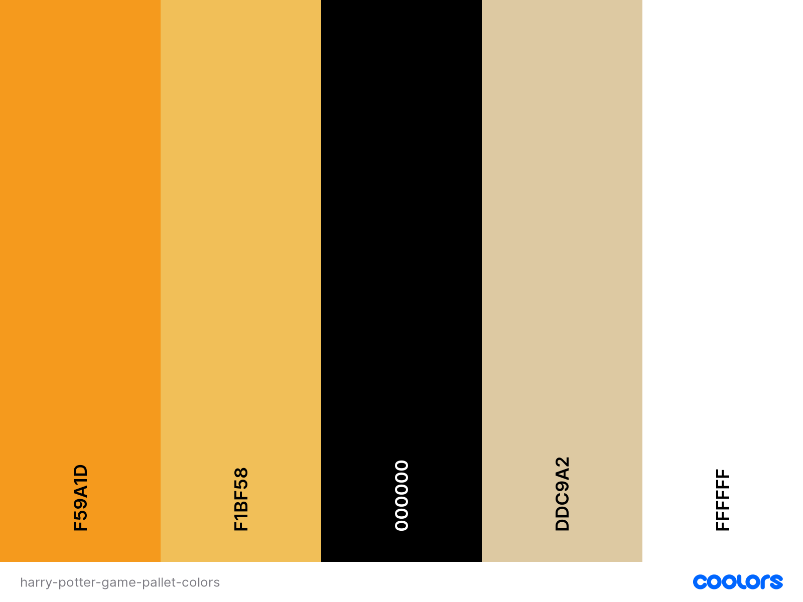

*Colour palette created at* [coolors.co](https://coolors.co/ffbe0b-fb5607-ff006e-8338ec-3a86ff).

- #f1bf58, cream Can color, is usually associated with reverence and humility, in addition to offering warmth and comfort. It is a color that encourages new ideas.
    - Used the background of every page. 
    - Use as the background-color of all buttoms.

- #2ec4b6, Turquoise color, the captivating sea-green stone of the ancients, represents wisdom, tranquility, protection, good fortune, and hope. 
    - Used in all titles.
    - Border of logo.
    - home section for praragraph.
    - In skills sections for progress bar
    - Used in menu for hover.
    - Animated btn boder for the contact form.

- #000000, Black color represents evil, darkness, night, and despair. It’s the color used to convey certainty and authority.
- Used in border of the contact.
- In the writing and most title and headings.
- Input fild.
- Use in all icons.

- #ddc9a2, Sapling color mean Calm, Elegant, Purity.
- Use in the background of the modal

- #F59A1D, Tree Poppy  or orange peel color associated with meanings of joy, warmth, heat, sunshine, enthusiasm, creativity, success, encouragement, change, determination, health, stimulation, happiness, fun, enjoyment, balance, sexuality, freedom, expression, and fascination. Orange is the color of joy and creativity.

- Use in for all hover elements.

#### Icons
Icons were used within the site in order to help the user to understand the content easier. 
They were taken from [Font Awesome](https://fontawesome.com/) and chosen to be self explanatory.

#### Typography

Because the game is composed mostly of images I decided to use simple font **Dancing Script**, this font is a company with **cursive** in case Dancing Script does not load. I have used this font for the form heading and input.

## Existing Features

The project consists of three main pages, and has a 404.html error page, a response page and error page for for the contact. The three main page can be accessed through the footer icons.

**Fabicon**

The portfolio’s favicon, displayed on the web Brower’s tab, allows the user to identify the website by sight.
 
**More Features**

- *** Game Logo ***: The logo of the game is the Harry Potter title. Designed in a Harry Potter font that is recognizable across all franchises.

- **Contact Page**: Allow the user to Contact me for any enquiries through.

**Footer**

Each page has a fixed footer at the bottom. This provides GitHub link, LinkedIn link, and icon to go to contact page to message directly if desired. Furthermore, it has an Instruction icon when it clicks a modal show up and provide information and rules about the game, and to the right it contains the copyright at my name.

#### Index.html (home)features
  -  Name of the game in a large decorative font, this is the first thing the player see when opening the game.
  - The main character flying across the page.
  -  Simple user-friendly icons for the user to navigate easily.
  - A button to start the game
  - A footer with icons and links 
#### game.html features
  - Title giving instruction.
  - Level 1 showing 8 cards,
  - level two with 16 cards, 
  - level three with 24 cards all identical with the Harry potter theme.
  - A footer with icons and links 
  - Top left-hand corner feature a flag poll that counts down to 30s.
  - Top right of the screen has a harry potter awl carrying mail that shows the game 
#### contact.html features
  - Title encoraging user to send a mesage.
  - A well structured contact form.
  - A Image representing a buttom that send the mesage
  - A footer with icons and links 
#### contact-response.html features
  - Has a positive message comfirming to the user that their message has been sent.
  - A botton that redirect the user back home if desired.
  - A footer with icons and links

#### contact-error-response.html features
  - Has a message informing the user that their message has not been sent.
  - A botton that redirect the user back to contact if desired to try again.
  - A footer with icons and links

  #### 404.html features
  - Has a message informing the user that the page they are loking for does not exist.
  - A botton that redirect the user back home if desired.
  - A footer with icons and links

### Future Feature Considerations
  - For adding future features I would like to implement a login and logout functionality and create a review system that allow users to imform me about improvement they would like to see in the game, I also would like to add more levels, I also would like to add a score board where player can compete to become top scorer.

## Technologies Used

* The project was written in HTML and CSS and JavaScript with litle use of bootstrap 5
* The project was written and tested in the [Gitpod](https://gitpod.io/) IDE.
* The project was debugged using [Google Chrome](https://www.google.com/intl/en_uk/chrome/) [Dev Tools](https://developers.google.com/web/tools/chrome-devtools).
* The project uses [GitHub](https://GitHub.com/) for hosting source code, for utilising git version control, and for hosting the site on GitHub pages.  
* The project's template was generated from [Code Institute's Gitpod Template](https://GitHub.com/Code-Institute-Org/gitpod-full-template).
* The project uses [FontAwesome](https://fontawesome.com/) v5.15.1, a free icon-set/toolkit for web development.
* The project uses [Google Fonts](https://fonts.google.com/) for typography.
* The project's images were compressed via [tinyjpg](https://tinyjpg.com/) to be appropriately sized for web content.
* The project's accessibility was assesed via WebAim's [W.A.V.E](https://wave.webaim.org/) and Google Chrome's [Lighthouse](https://developers.google.com/web/tools/lighthouse).
* The project's screen-reader accessibility was tested using [Screen Reader for Google Chrome](https://chrome.google.com/webstore/detail/screen-reader-for-google/nddfhonnmhcldcbmhbdldfpkbfpgjoeh/related?hl=en).
* The project used Toptal's [Colorfilter](https://www.toptal.com/designers/colorfilter/) to assess how colour-blind-friendly the site was.
* The project's colour contrast ratio was assessed using [Contract-Ratio](https://webaim.org/resources/contrastchecker/)
* The project's HTML was validated using [W3C HTML Markup Validator](https://validator.w3.org/).
* The project's CSS was validated using [W3C Jigsaw CSS Validator](https://jigsaw.w3.org/css-validator/).
* The project's wireframes were designed in [Balsamiq](https://balsamiq.com/wireframes/).
* [Slack](code-institute-room.slack.com). Used during all phases of development and testing to find the answers to questions and the solutions to problems enountered.
* [Code Pen](https://codepen.io/denic/pen/GRoOxbM). The code for the typing animation efect on index.html page was initially sourced from the codepen.io site.
* [Coolors](https://coolors.co/ffbe0b-fb5607-ff006e-8338ec-3a86ff). Used to choose a colour scheme.
* [flaticon](https://www.flaticon.com/search?word=python&type=icon). Also Used for progress bar icons in skills.html.
* [icons8.com](https://icons8.com/icons/set/html). Used for progress bar icons in skills.html.
* [chir.ag](https://chir.ag/projects/name-that-color/#07203A). Used for checking the real name of the colors implemented.
* [Favicon.io](https://favicon.io/favicon-converter/). used to convert the logo to favicon.
* [designs.ai](https://designs.ai/colors/color-meanings/midnight-blue). used to check colors combinations to achieve beautiful results.
* [cloudconverted.com](https://cloudconvert.com/png-to-webp). used to convert png images to webp for better performance.
* [Adobe illustrator.](https://www.adobe.com/uk/products/illustrator.html). used to draw all images.
* [dafont.com](https://www.dafont.com/). used to for the Farry Potter font.
* [freepik.com](https://www.freepik.com/free-vector/error-404-concept-illustration_7741849.htm#query=404&position=4&from_view=keyword). 404 error image was taken from here.
* [freesound.org](https://freesound.org/people/f4ngy/sounds/240776/). use for the game sounds.

## Testing

[Google Chrome Developer Tools](https://developers.google.com/web/tools/chrome-devtools) were used extensively throughout the development process in order to test whether elements were responsive when viewed on mobile and tablet devices. When problems were encountered the Device Selector was used to target the element.  Using the Elements Panel in Developer Tools the code in question was altered in order to achieve the desired result. 
Working code snippets were then replicated in the style.css file in [Gitpod](https://www.gitpod.io/). Other solutions for errors were found in the Code Institute [Slack](code-institute-room.slack.com) channels, on [Stack Overflow](https://stackoverflow.com/), on [W3Schools](https://www.w3schools.com) and on [Code Pen](https://codepen.io).

  ### Home Page

The website was regularly tested using the Google Chrome Developer Tools Lighthouse test. During the testing I highlighted three errors across the site which have since been recitified:

 Erro 1 - "Elements contain focusable descendents" [Image of the issue](assets/documentation/testing/home-error.png)

 Erro 2 - "Links do not have dicernible name" [Image of the issue](assets/documentation/testing/accesibility-errors.png)

Erro 3 - "Images are not properly size"

My game is made of mostly using images. Images are very dificult to get a good score with google chrome, I have try to increase the score by changing the images extension from png to webp or avif as google Chrome Lighthouse recommend to get better score however Safari does not support this file and for does not show the images.

**Solution Error 1** Added i tag with classes for icons in footer.

**Solution Error 2** Added aria-label and rel attribute.

**Solution Error 3** Properly size images.

#### Home
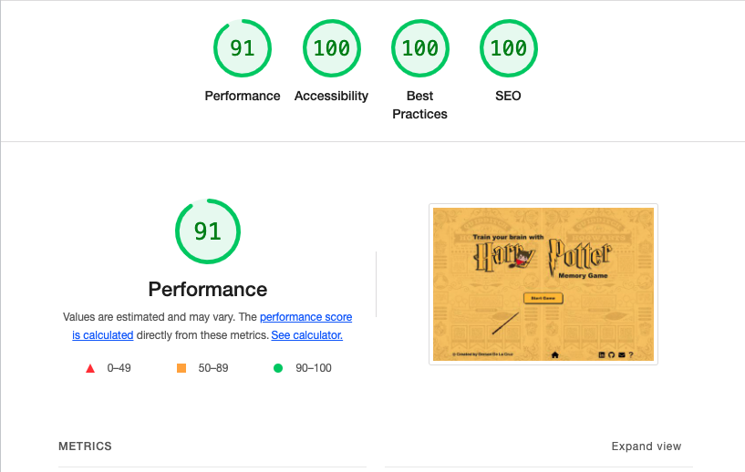

#### Game
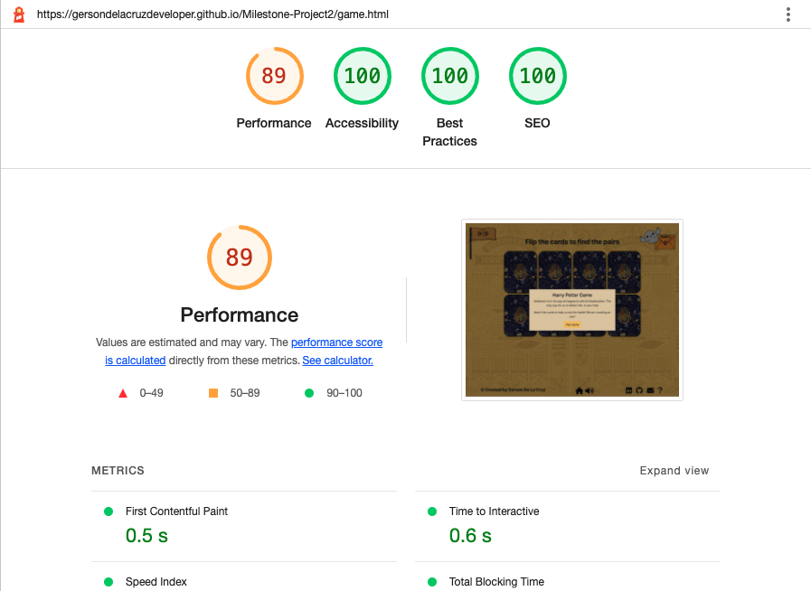
 

### contact Page

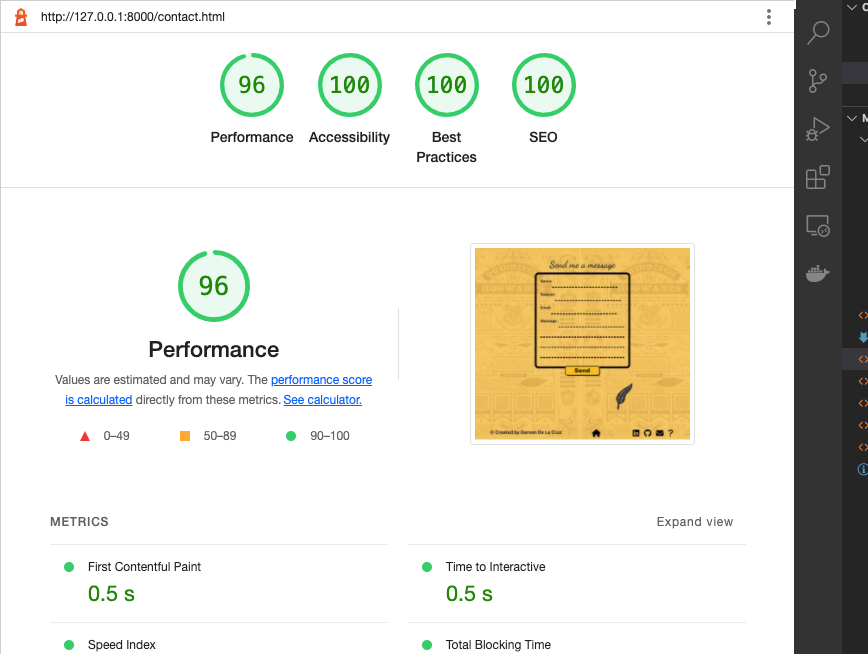

### Contact response page
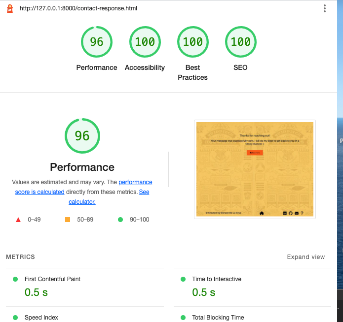

### Contact response error page
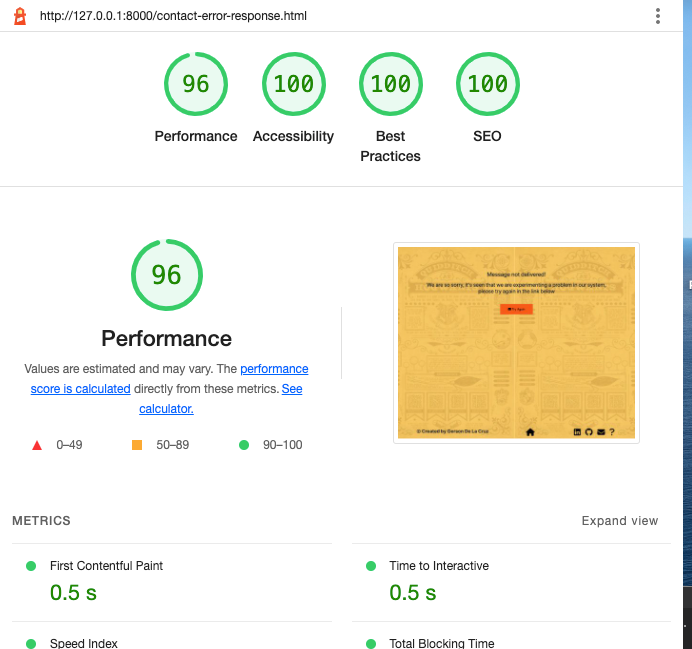

### 404 page
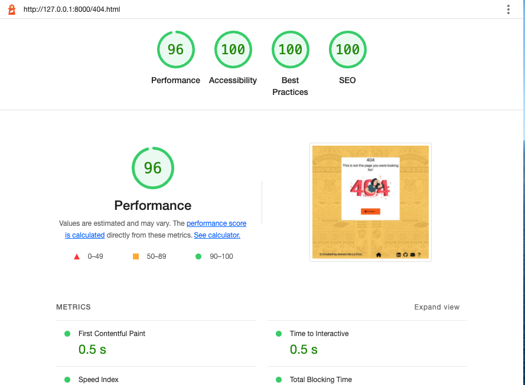

 

### HTML Validation

[W3C HTML Validation Service](https://validator.w3.org/#validate_by_uri) was used to validate the HTML documents. It highlighted four errors across the site which have since been recitified: 
- Misspell div element in home and contact page, the correct element was added.
- "Element bold not allowed as a child of element p". The element was eliminated and added a class called bold.
- "The aria-labelledby attribute must point to an element in the same document". I copied the code for the modal from bootstrap and as I was opening the modal with my own javascript, ther were no need for me to used aria-labelledby attribute, so I deleted the aria-labelledby.
- "Duplicate ID" Deleted the ids and added classes. 

The site currently has no errors:

### Home page 
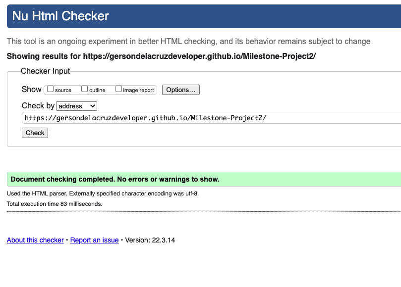

### Game page 
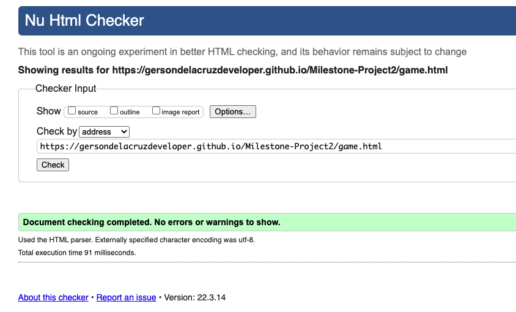

### Contact page 
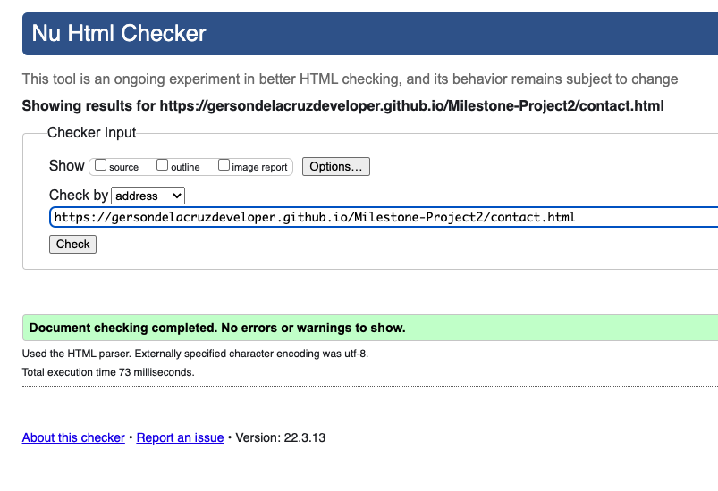

 

### CSS Validation

[W3C CSS Validation Service](https://jigsaw.w3.org/css-validator) was used to validate the style.css file.

There were no errors to show so I did not have to fix anything:

The style.css file currently has no errors:
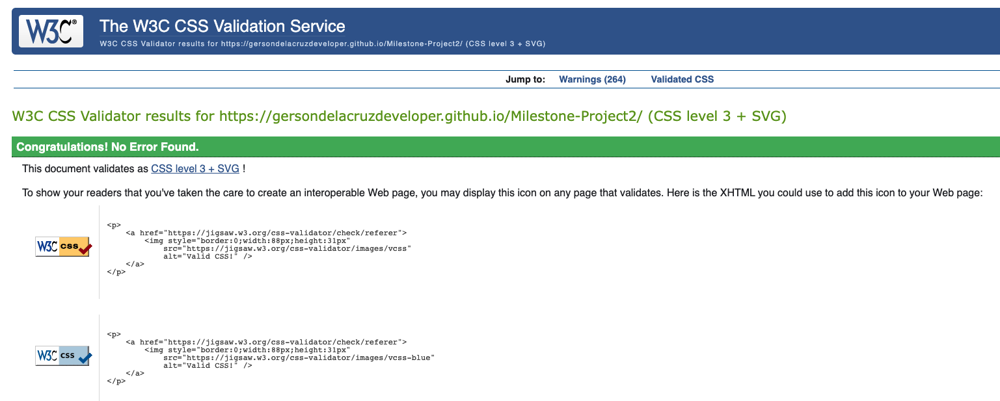

 

### Manual Testing
The game has been tested in the following browsers:
- Chrome Version 85.0.4183.121 
- Samsung Internet Version 12.0.1.47	
- Microsoft Edge Version 85.0.564.63 
- Opera 70
- Mozilla Firefox 81.0.1

The game works and functions as expected on Samsung Internet, Google Chrome, Microsoft Edge, Opera and Firefox.
 

### Responsiveness
The game was tested for responsive design using [Google Chrome Developer Tools](https://developers.google.com/web/tools/chrome-devtools).  
It was tested, and found to respond appropriately with regard to each of the following:

**Mobile devices:**
- Moto G4
- Galaxy S5
- Pixel 2
- Pixel 2 XL
- iPhone 5/SE
- iPhone 6/7/8
- iPhone 6/7/8 Plus
- iPhone X

**Tablet devices:**
- iPad
- iPad Pro
- Surface Duo
- Galaxy Fold

**Laptop dimensions:**
- 15" Laptop (1024 x 800)
- 13" Laptop (1024 x 800)

**Desktop dimensions:**
- 24" Desktop (1920 x 1200)
- 22" Desktop (1680 x 1050)
- 20" Desktop (1600 x 900)

 
## Navigation bar (Navbar)

## Navigation in (footer)

All functionality for the footer was manualy tested on every page.

* Visit all links within the navbar in every possible order to ensure they are functional and route correctly.

* Play the game in every level to ensure the game works as espected.

## Enquire Form
*Ensure all placeholders has its appropriate name.
*Ensure Full Name field accepts any value, but requires at least one character to be deemed valid.
*Ensure Subject field accepts any value, but requires at least one character to be deemed valid.
*Ensure Message field accepts any value, but requires at least one character to be deemed valid.
*Ensure Email field only accept values in appropriate email format and cannot leave it in blank.
*Ensure all input request are met before submitting the form.
*Ensure users or potential employers received the nice and tidy message after submitting the form.

 
 

### Bugs

No bugs

 

## Deployment

## How this Project was Deployed

This project was deployed to GitHub pages via the following steps:

1. Log into [GitHub](https://GitHub.com/).
2. From the list of Repositories, select [Milestone-Project2 ](https://github.com/Gersondelacruzdeveloper/Milestone-Project2).
3. From the Repositories sub-headings, select "Settings".
4. Under "Options", the first category of settings, scroll down to the GitHub Pages section.
5. From the dropdown list under the "Source" heading, select "master".
6. A second drop-down menu that appears should remain as the default value, "/root".
7. Press Save. 
8. On Page refresh, scroll back down to the GitHub Pages section, and the link to the deployed site will be available in a green sub-section with a tick icon next to it.

As this project was developed on the master branch, all changes made to the repository are immediately reflected in the deployed project.

## How to Run this Project in your Browser

1. Install the [Google Chrome](https://www.google.co.uk/chrome/) or [Firefox](https://www.mozilla.org/en-GB/exp/firefox/new/) browser.
2. Install the applicable [GitPod](https://www.gitpod.io/docs/browser-extension/) Browser Extensions for your chosen browser.
4. Create a [GitHub](https://GitHub.com/join) account. 
3. Log in to [Gitpod](https://gitpod.io/login/) using your GitHub account.
4. From the list of Repositories select [Milestone-Project2 ](https://github.com/Gersondelacruzdeveloper/Milestone-Project2)
5. Open the repository in Gitpod:
    * Click the green "Gitpod" icon at the top of the Repository.
6. A new workspace will open with the current state of the master branch. Any changes made to the master branch after this point will not be automatically updated in your Gitpod Workspace.

### Cloning the Repository

1. Vsisit this link [Milestone-Project2 ](https://github.com/Gersondelacruzdeveloper/Milestone-Project2).
2. Click the "Code" dropdown box above the repository's file explorer. 
3. Under the "Clone" heading, click the "HTTPS" sub-heading.
4. Click the clipboard icon, or manually copy the text presented: `https://github.com/Gersondelacruzdeveloper/Milestone-Project2.git`
5. Open your preferred IDE (VSCode, Atom, PyCharm, etc).
6. Ensure your IDE has support for Git, or has the relevant Git extension.
7. Open the terminal, and create a directory where you would like the Repository to be stored.
8. Type `git clone` and paste the previously copied text (`https://github.com/Gersondelacruzdeveloper/Milestone-Project2.git`) and press enter.
9. The Repository will then be cloned to your selected directory. 

### Manually Downloading the Repository

1. Vsisit this link [GitHub Repository](https://GitHub.com/BAK2K3/hard-drivers).
2. Click the "Code" dropdown box above the repository's file explorer. 
3. Click the "Download ZIP" option; this will download a copy of the selected branch's repository as a zip file.
4. Locate the ZIP file downloaded to your computer, and extract the ZIP to a designated folder which you would like the repository to be stored.

### Opening the Repository 

1. Open your preferred IDE (VSCode, Atom, PyCharm, etc).
2. Navigate to the chosen directory where the Repository was Cloned/Extracted.
3. You will now have offline access to the contents of the project.

---

## Credits

### Content

* All text used throughout the site was written by me.
* All general development concepts were devised by me.

### Media

* All png images were sourced from [flaticon](https://www.flaticon.com/search?word=python&type=icon) and [icons8.com](https://icons8.com/icons/set/html)

* [flaticon](https://www.flaticon.com/search?word=python&type=icon). Used for most of the progress bar png image except from the last one in skills.html.
* [icons8.com](https://icons8.com/icons/set/html). Used for the last image in progress bar in skills.html. 

## Code

* HTML/CSS: Implementation and utilisation of Grid CSS layout was assisted by [CSS-Tricks](https://css-tricks.com/snippets/css/complete-guide-grid/).
]
* HTML/CSS: Implementation and utilisation of Grid CSS layout was assisted by [W3school](https://www.w3schools.com/css/css_grid.asp).

* HTML/CSS: code for fliping the card found here and modified acording to my requierments [W3school](https://www.w3schools.com/howto/howto_css_flip_card.asp).

* HTML/CSS: code for spinners W3school](https://www.w3schools.com/howto/tryit.asp?filename=tryhow_css_loader2).

---

## Acknowledgements

- [Code Institue](https://codeinstitute.net/) and the very helpful tutors.
- My project mentor [Gurjot Singh](https://www.linkedin.com/in/gurjot-singh-64466b199/) for his help and guidance during the design and build process. 
- The [Code Institue](https://codeinstitute.net/) community on [Slack](code-institute-room.slack.com) for their support.

 

# Disclaimer

This Portfolio is for educational purposes only.

---